### 软件题目

[班级投票系统 https://github.com/wanggh8/ClassBallot](https://github.com/wanggh8/ClassBallot)

### 选题构思和背景

在今年参加学长团担任leader时，需要选举临时负责人和班委，在竞选候选人中，采取纸质投票的方式，但是这种方式浪费了时间和人力，同时在唱票的过程中还需要公证人增加信服度，区块链是可信的，同时又是可靠的，为单独每一个人创造一个区块，每个人通过自己的学号创建用户，创建投票的区块给参与投票的账户授权。授权后可以进行为候选人投票，未授权的投票无效不作统计。之后再统计选票。区块的投票信息是不可篡改的。

**流程：**

1. A发起智能合约,添加竞选候选人
2. A设定那些人可以进行投票,先对可以进行投票的人授权
3. 已经被授权的人可以投票,没被授权的人投票无效
4. 计算最终那个选项投票数最多
5. 如果最终票数最高的不止一人，对投票数据重置，同时添加获胜者为候选人进行第二轮投票
6. A可以进行重置投票系统，初始化一个新的投票

### 使用说明

#### 合约部署

##### **部署命令**

实验环境：

- nodejs

- npm

- express模块

- truffle模块
- web3模块
- fs模块
- jquery-3.2.1.js

初始化框架命令`truffle init`

编译命令`truffle compile`

部署命令`truffle migrate`

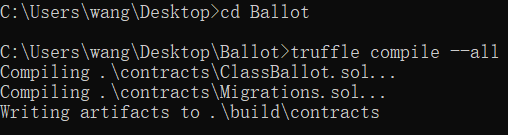

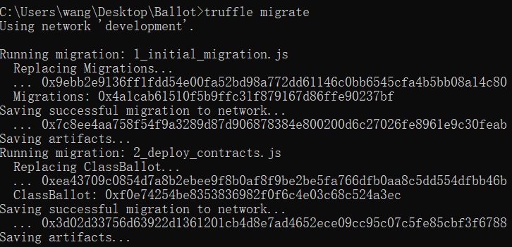

##### **服务端运行合约**

打开服务器，这里使用Ganache用于部署合约

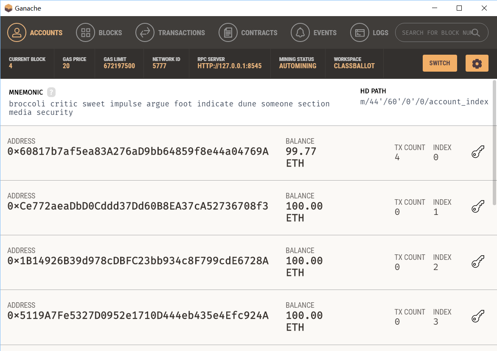

打开网页服务器`node app.js`，使用truffle和express框架，显示的前10行为账户信息，默认显示前10个，第一个为管理员账户

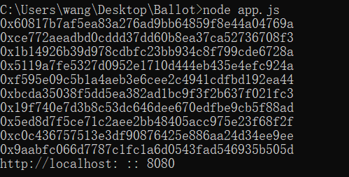

### **客户端使用以及测试**

在网页客户端打开http://localhost:8080/，显示第一个登陆界面

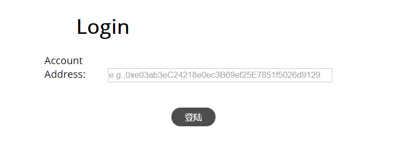

将管理员的地址复制进去，则：按钮显示为Host，再次点击可以进入管理员界面

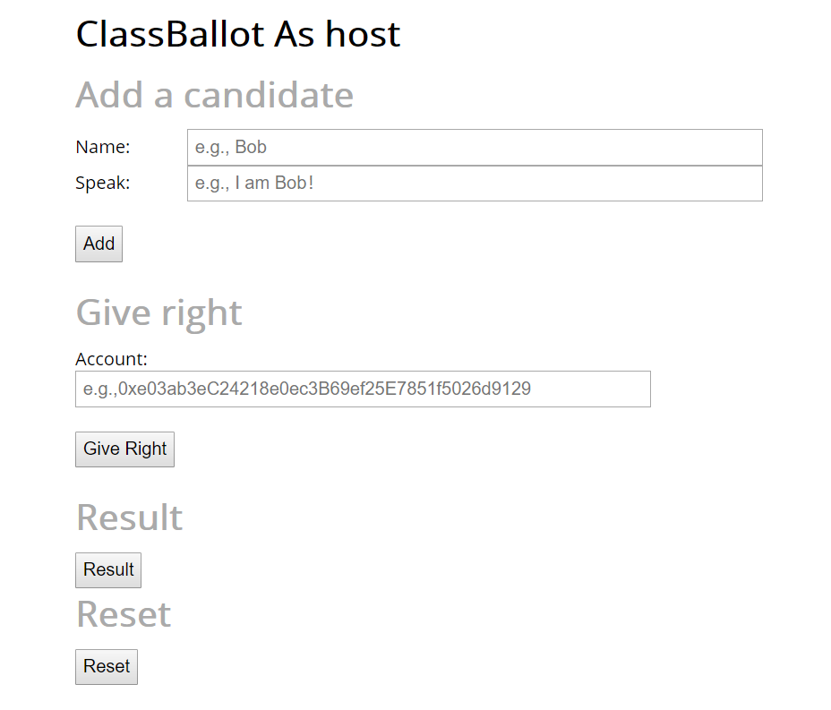

管理员有4项权力，分别为添加候选人、给投票者权限、计算票数和结果以及初始化新的投票

**添加候选人**

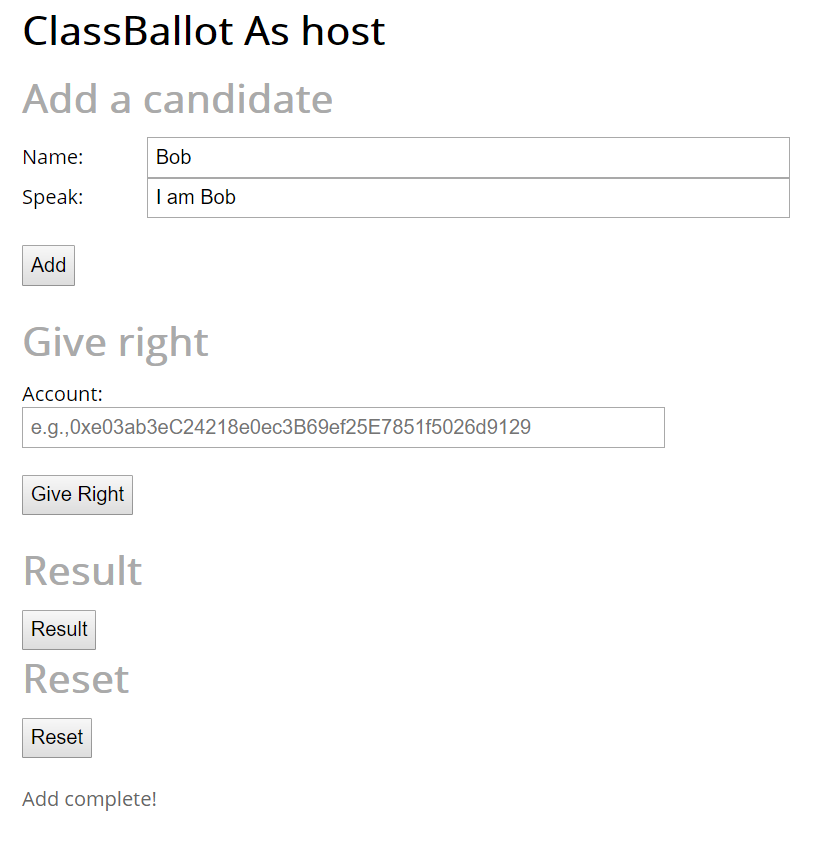

**为投票者添加权限**

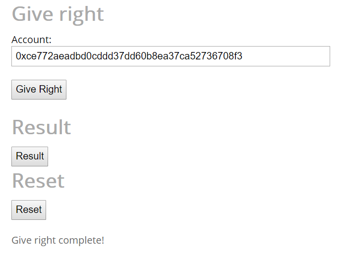

**计算投票结果**

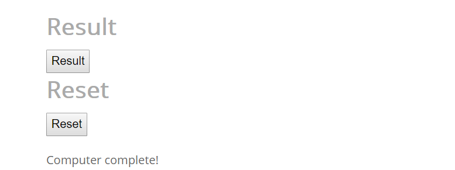

由于此时只有一个候选者Bob，即使获得的投票数为0，但也是胜利者

再添加一个候选人Jack，此时由于Bob和Jack的票数一样，都是0，所以需要再次投票

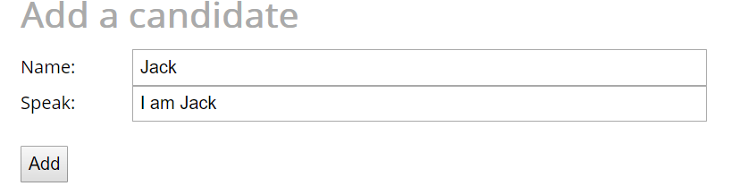

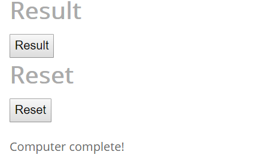

**使用未授权的账户登录投票系统**

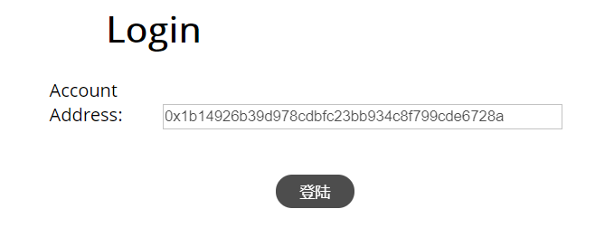

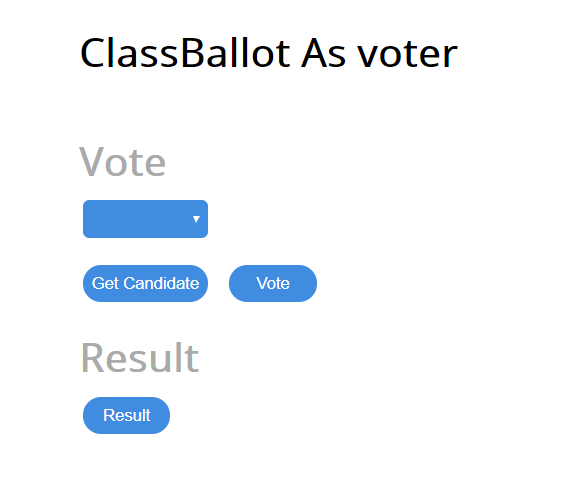

首先获取当前的候选人

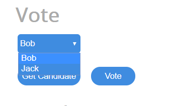

为Bob投票

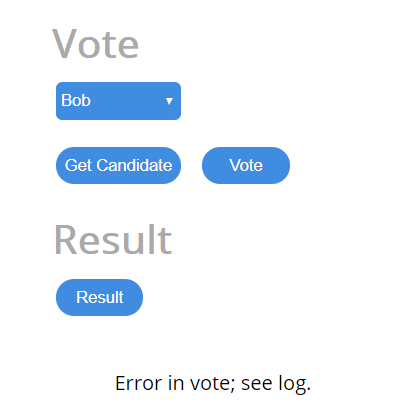

出现错误，从捕获的异常来看，对应合约可以看出未授权的投票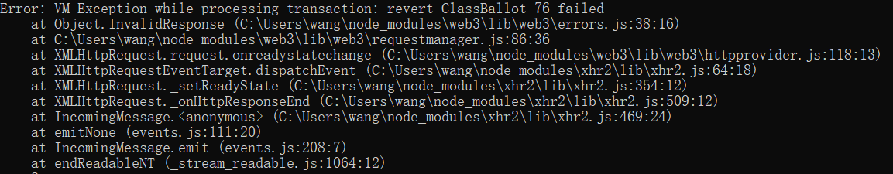

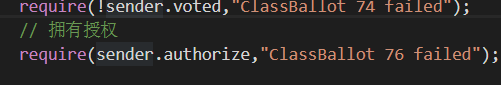

点击Result仍然可以显示当前主持人发布的胜利者信息

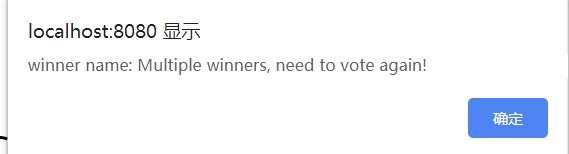

**以已授权的投票账户登录**

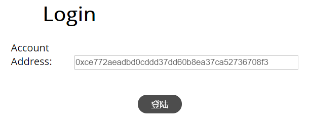

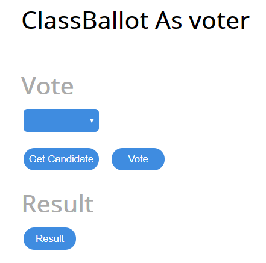

同样首先获取候选人

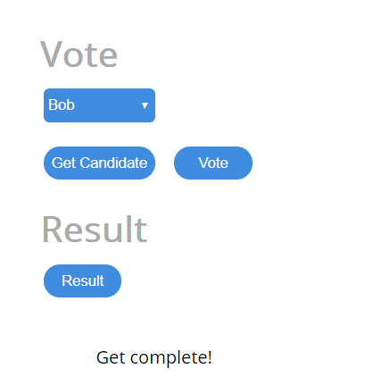

进行投票，可以看出投票成功

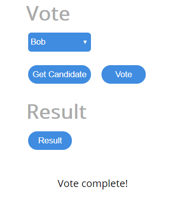

此时查看结果，结果还是上次主持人计算时的结果，并未记上当前的投票信息

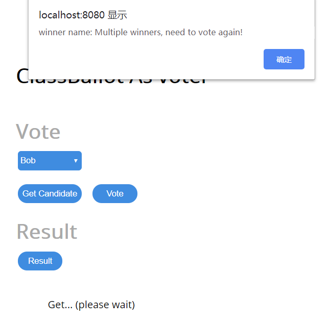

登录管理员账户，重新计算投票结果，可以看到此时获胜者为Bob

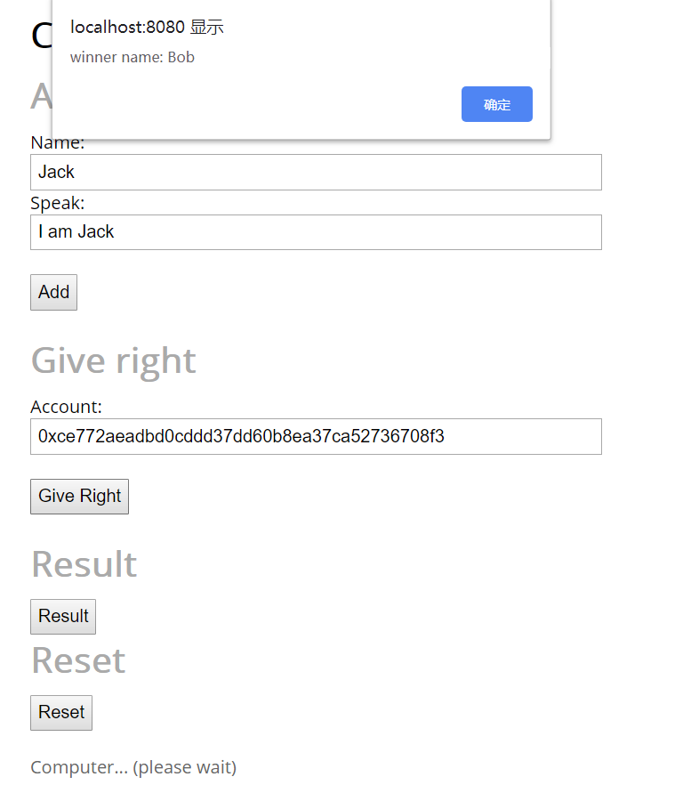

再在投票的账户获取结果：

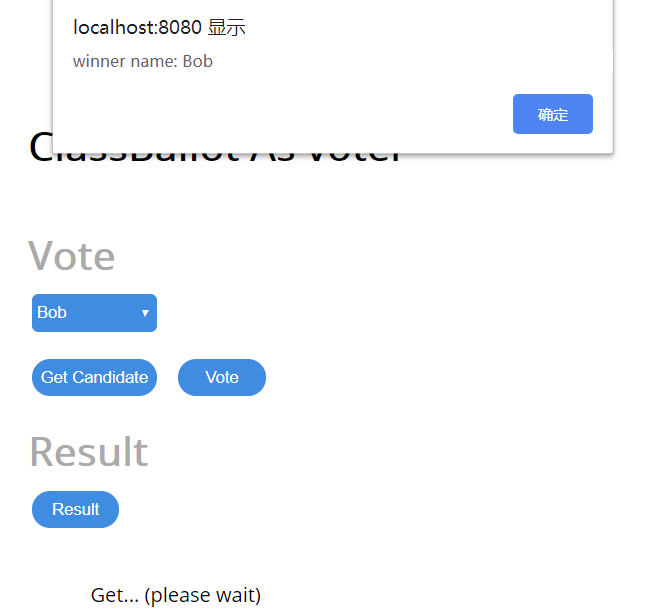

可以看到此时的胜利者已经是Bob

使用管理员账户对新的投票者授权

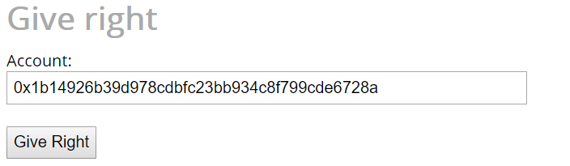

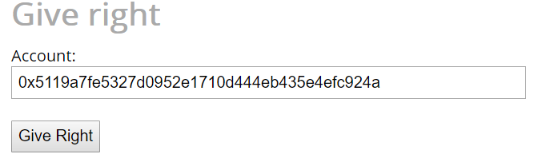

添加新的候选人Mary

 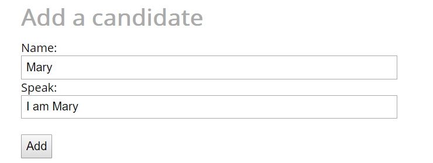

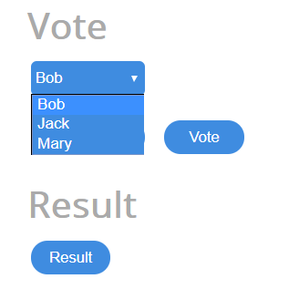

登录进行投票给Jack

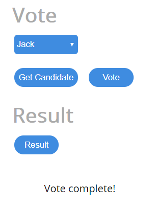

管理员获取结果

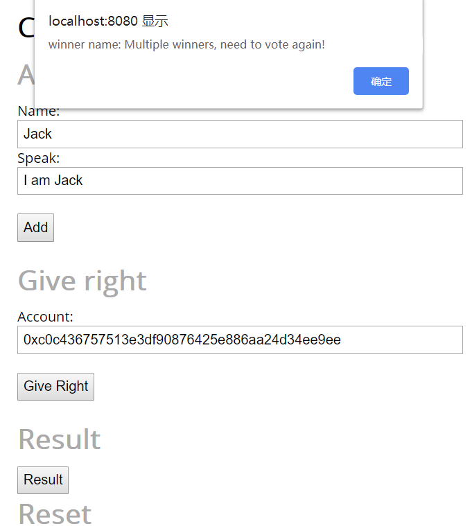

此时由于Bob和Jack都是一票，票数相同需要重新投票，同时重置投票候选人为Bob和Jack，对所有授权的投票者的投票记录删除，可以再次投票

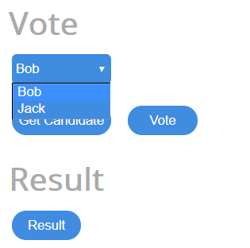

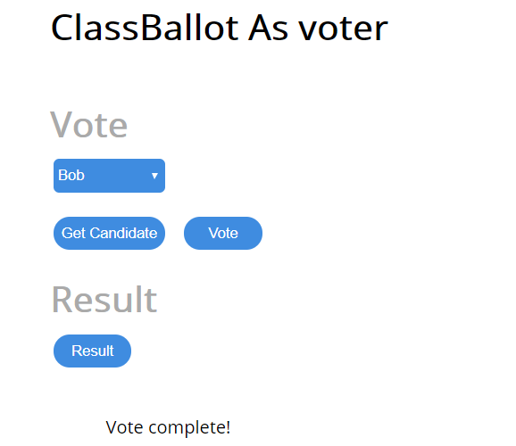

此时再次获取胜利者为Bob

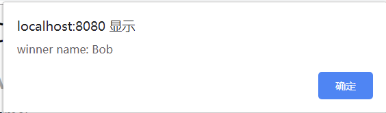

重置按钮，可以将候选人，当前胜利者，授权的投票账户全部清空

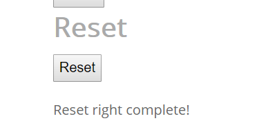

获取候选人为空

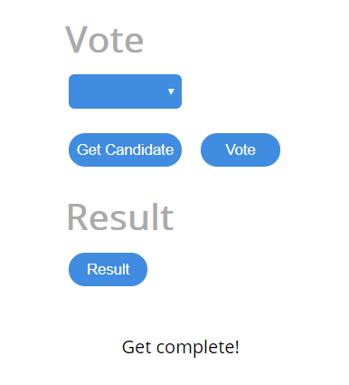

添加新的候选人Bob和Jack

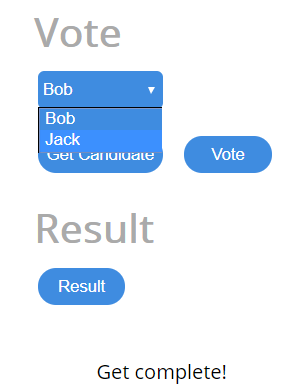

直接不进行授权投票

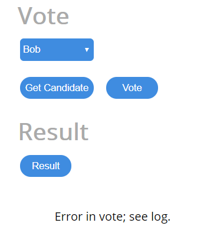

获取投票结果

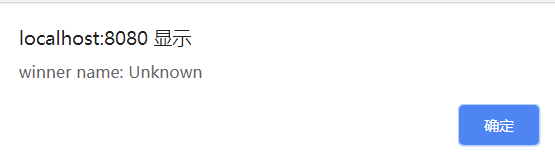

对账户进行授权，投票成功

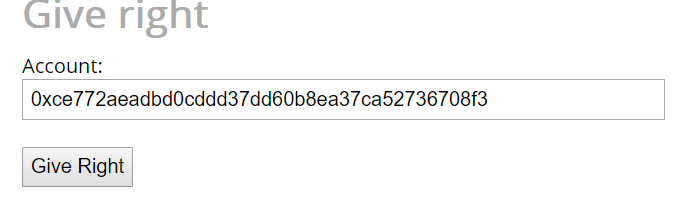

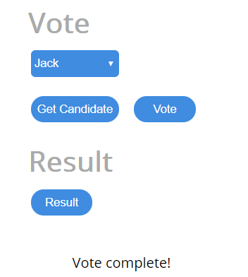

管理员获取实验结果：

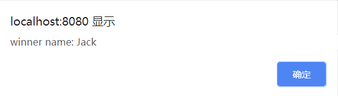